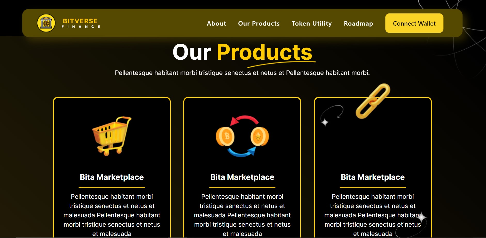

# BITVERSE FINANCE

Welcome to Bitverse Finance, your go-to React-based platform for hassle-free cryptocurrency transactions. Dive into a sleek and intuitive interface with real-time market data and captivating animations.

## Discover Cryptos with Style

Explore our diverse range of cryptocurrencies effortlessly. Get comprehensive info, real-time market data, and make transactions seamlessly with our user-friendly design.

## Milestones in a Glance

Check out our interactive roadmap to see our achievements over the past year. From successful launches to strategic partnerships, we've got it all visually presented for you.

## Explore Crypto Gems

Dive into our token section. Scroll through a curated collection with ease. Only six cards are displayed at a time, making your exploration user-friendly.

## Stay Connected

Connect with us on social media with our sleek footer. Follow our journey and stay updated. Copyright info is here, ensuring a protected and confident user experience.

## Demo Video

Watch our demo [here](https://drive.google.com/file/d/1aAiWMz0QkclYxARdUhs-CcwNGoz-UHpJ/view?usp=drive_link).

## Seamless Deployment

Experience fast loading times and reliable performance. Our platform is deployed on Vercel, ensuring a smooth user experience.

[Visit Bitverse Finance](https://bitverse-token.netlify.app/)

## Tech Stack

- **Client:** React, JavaScript, CSS, StyledComponet
- **Server:** Node, Express, 

## API Reference

Please note our API is hosted on a free service, which may result in longer loading times. We're working on optimizing it for a smoother experience.

**API URL:** [Bitverse Finance API](https://bitverse-sej5.onrender.com/data)

Thank you for your patience, and we hope you enjoy using Bitverse Finance!
